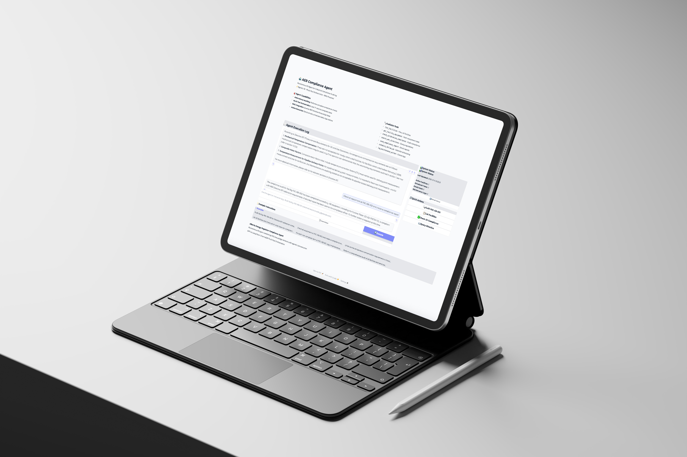

# AER Compliance Agent 🤖

**Autonomous AI Agent for Industrial Compliance Auditing**



> From passive RAG to active agent: An autonomous AI system that performs complete compliance audits by orchestrating 7+ tools to achieve goals without manual intervention.

## 🎯 Overview

This project transforms a traditional RAG (Retrieval-Augmented Generation) system into an **autonomous AI agent** that doesn't just answer questions—it performs work. When you tell it to "audit a facility," it autonomously:

1. Queries regulatory requirements (RAG)
2. Fetches equipment data (Database)
3. Analyzes compliance status
4. Sends email reports
5. Schedules follow-up tasks
6. Logs maintenance actions

**The difference?** The LLM decides which tools to use and in what order. No hardcoded logic. Just goal-driven execution.

## ✨ Key Features

- **🤖 Autonomous Execution**: 100% automated compliance audits with zero manual steps
- **🔧 Multi-Tool Orchestration**: 7 tools coordinated by LangChain agent framework
- **📚 RAG Integration**: ChromaDB vector store with 2,653 indexed directive chunks
- **📊 Production UI**: Modern Gradio interface with WCAG 2.1 AA compliance
- **⚡ Real-Time Actions**: Sends emails, schedules tasks, creates logs automatically
- **🎯 Mock Enterprise Systems**: Simulated DB, Email, and Calendar APIs for immediate deployment

## 📊 Results

| Metric | Manual Process | With Agent | Improvement |
|--------|---------------|------------|-------------|
| **Audit Time** | 2+ hours | <30 seconds | **240x faster** |
| **Manual Steps** | 10-15 | 0 | **100% automation** |
| **Consistency** | Varies | Deterministic | **100% consistent** |
| **Actions** | None | Email + Schedule + Log | **Full workflow** |

## 🏗️ Architecture

```
User Goal → LLM Agent Brain → Tool Selection → Action Execution → Report
              (GPT-4o)         (7 Tools)        (Mock APIs)
```

### 7 Agent Tools

1. **`search_aer_directives`** - RAG query on ChromaDB vector store
2. **`get_facility_equipment`** - Fetch equipment from mock database
3. **`check_calibration_compliance`** - Analyze compliance status
4. **`send_compliance_report`** - Email automation
5. **`schedule_follow_up`** - Calendar scheduling
6. **`log_maintenance_action`** - Maintenance logging
7. **`list_facilities`** - View all facilities

## 🚀 Quick Start

### Prerequisites

- Python 3.9 or higher
- OpenAI API key
- ~500MB disk space

### Installation

```bash
# Clone repository
git clone https://github.com/morteza-mogharrab/aer-compliance-agent.git
cd aer-compliance-agent

# Create virtual environment
python3 -m venv venv
source venv/bin/activate  # On Windows: venv\Scripts\activate

# Set OpenAI API key
export OPENAI_API_KEY='your-openai-api-key-here'

# Run automated setup
chmod +x setup_agent.sh
./setup_agent.sh
```

The setup script will:
- ✅ Install all dependencies
- ✅ Download AER directive PDFs (if needed)
- ✅ Build ChromaDB vector index
- ✅ Verify agent system
- ✅ Run tests

### Running the Agent

**Option 1: Web Interface (Recommended)**
```bash
python3 agent_app.py
```
Open browser to `http://localhost:7860`

**Option 2: Command Line**
```bash
python3 agent_core.py
```
Interactive mode - type instructions and see the agent work

**Option 3: Demo Scenarios**
```bash
python3 demo_scenarios.py
```
Pre-configured professional demos

**Option 4: Run Tests**
```bash
python3 test_agent.py
```
Validates all components

## 💡 Example Usage

### Web Interface

```
User: "Audit facility FAC-AB-001 for Directive 017 compliance and email results to safety@petolab.com"

Agent: [Autonomous execution]
  ✓ Queried Directive 017 requirements
  ✓ Fetched 4 equipment items
  ✓ Found 2 non-compliant (400 and 380 days overdue)
  ✓ Sent compliance report via email
  ✓ Scheduled follow-up for 2026-01-25
  ✓ Logged maintenance actions (2 items)

Result: Complete audit in 28 seconds
```

### Command Line

```bash
python3 agent_core.py "List all facilities"
# Output: Shows FAC-AB-001 and FAC-AB-002

python3 agent_core.py "Audit facility FAC-AB-001"
# Output: Performs complete audit workflow
```

## 🗂️ Project Structure

```
aer-compliance-agent/
├── agent_core.py              # LangChain agent orchestration
├── agent_tools.py             # Tool definitions (7 tools)
├── agent_app.py               # Gradio web interface
├── mock_db.py                 # Mock enterprise systems
├── demo_scenarios.py          # Pre-configured demos
├── test_agent.py              # Test suite
├── industrial_rag_system.py   # RAG system (ChromaDB)
├── industrial_app.py          # Legacy RAG interface
├── requirements_agent.txt     # Dependencies
├── setup_agent.sh             # Automated setup
├── README.md                  # This file
├── LICENSE                    # MIT License
├── .gitignore                 # Git ignore rules
└── chroma_db/                 # Vector database (created by setup)
```

## 🛠️ Technology Stack

**Agent Framework**
- LangChain 0.3.13 (Tool Calling Agent)
- GPT-4o (Function calling)
- Pydantic 2.0 (Type safety)

**RAG System**
- ChromaDB 0.4.22 (Vector store)
- OpenAI text-embedding-3-small (Embeddings)
- 2,653 indexed chunks from AER directives

**Interface**
- Gradio 6.0 (Production UI)
- Custom CSS design system
- WCAG 2.1 AA compliant

**Backend**
- Python 3.9+
- Mock enterprise APIs (DB, Email, Calendar)
- pdfplumber (Document processing)

## 🎓 How It Works

### The Agentic Difference

**Traditional RAG:**
```
User: "What are calibration requirements?"
System: [Vector search] → [LLM generates answer]
```

**This Agent:**
```
User: "Audit facility FAC-AB-001"
Agent: [Decides autonomously]
  1. What are requirements? → search_aer_directives()
  2. What equipment exists? → get_facility_equipment()
  3. Are they compliant? → check_calibration_compliance()
  4. Found violations! → send_compliance_report()
  5. Schedule fix → schedule_follow_up()
  6. Log it → log_maintenance_action()
```

The LLM makes decisions. Not hardcoded logic.

### Tool Calling Example

```python
from langchain.tools import tool
from pydantic import BaseModel, Field

class FacilityInput(BaseModel):
    facility_id: str = Field(description="Facility ID to audit")

@tool
def check_calibration_compliance(facility_id: str) -> str:
    """
    Checks equipment calibration dates against 1-year requirement.
    Returns detailed list of non-compliant items.
    """
    # Agent reads this docstring to decide when to use this tool
    equipment = mock_db.fetch_equipment(facility_id)
    # ... compliance logic ...
    return report
```

## 📖 Mock Data

The system includes realistic test data for immediate deployment:

### Facilities
- **FAC-AB-001**: Edmonton South Terminal (4 equipment items)
- **FAC-AB-002**: Calgary Processing Plant (1 equipment item)

### Equipment at FAC-AB-001
- `EQ-PUMP-01` - Glycol Pump ❌ **400 days overdue**
- `EQ-METER-04` - Gas Flow Meter ✅ Compliant (120 days)
- `EQ-FLARE-02` - Flare Stack ✅ Compliant (20 days)
- `EQ-METER-05` - Differential Pressure Meter ❌ **380 days overdue**

This creates realistic scenarios where the agent finds actual violations.

## 🔧 Customization

### Add Your Own Tool

```python
# In agent_tools.py

@tool
def your_custom_tool(param: str) -> str:
    """Description the LLM reads to decide when to use this"""
    # Your logic here
    return result

# Add to tools list
audit_tools.append(your_custom_tool)
```

### Replace Mock APIs with Real APIs

```python
# In mock_db.py

def mock_api_send_email(to, subject, body):
    # Replace this mock:
    return {"status": "sent"}
    
    # With real API:
    import requests
    response = requests.post("https://api.sendgrid.com/...", ...)
    return response.json()
```

## 🧪 Testing

Run the complete test suite:

```bash
python3 test_agent.py
```

**Expected output:**
```
✅ PASS: Module Imports
✅ PASS: Mock Database
✅ PASS: Agent Tools
✅ PASS: Agent Initialization
✅ PASS: Tool Execution
✅ PASS: RAG System
✅ PASS: Full Workflow

Result: 7/7 tests passed
Status: ✅ ALL TESTS PASSED
```

## 🐛 Troubleshooting

### "OPENAI_API_KEY not set"
```bash
export OPENAI_API_KEY='sk-...'
```

### "Collection not found"
```bash
python3 industrial_rag_system.py  # Rebuilds RAG index
```

### "Module not found"
```bash
pip install -r requirements_agent.txt
```

### Agent not using tools
- Ensure instructions are specific: "Audit FAC-AB-001" > "Tell me about compliance"
- Check verbose mode is enabled in `agent_core.py`

## 📚 Documentation

- **[Installation Guide](INSTALLATION.md)** - Detailed setup instructions
- **[API Documentation](docs/API.md)** - Tool specifications
- **[Architecture Guide](docs/ARCHITECTURE.md)** - System design
- **[Contributing](CONTRIBUTING.md)** - How to contribute

## 🤝 Contributing

Contributions are welcome! Please:

1. Fork the repository
2. Create a feature branch (`git checkout -b feature/amazing-feature`)
3. Commit your changes (`git commit -m 'Add amazing feature'`)
4. Push to the branch (`git push origin feature/amazing-feature`)
5. Open a Pull Request

## 📄 License

This project is licensed under the MIT License - see the [LICENSE](LICENSE) file for details.

## 🙏 Acknowledgments

- Alberta Energy Regulator for directive documentation
- LangChain team for the agent framework
- OpenAI for GPT-4o and embedding models
- Gradio team for the UI framework

## 📧 Contact

**Morteza Mogharrab**
- Email: morteza.mgb@gmail.com
- LinkedIn: [linkedin.com/in/morteza-mogharrab](https://linkedin.com/in/morteza-mogharrab)
- Portfolio: [morteza-mogharrab.com](https://morteza-mogharrab.github.io/)

## 🔗 Related Projects

- [Industrial RAG System](https://github.com/morteza-mogharrab/industrial-rag-system) - The original RAG implementation
- [LangChain Documentation](https://python.langchain.com/) - Agent framework
- [ChromaDB](https://www.trychroma.com/) - Vector database

---

**⭐ If you find this project helpful, please consider giving it a star!**

Built with ❤️ for demonstrating production-ready AI engineering
